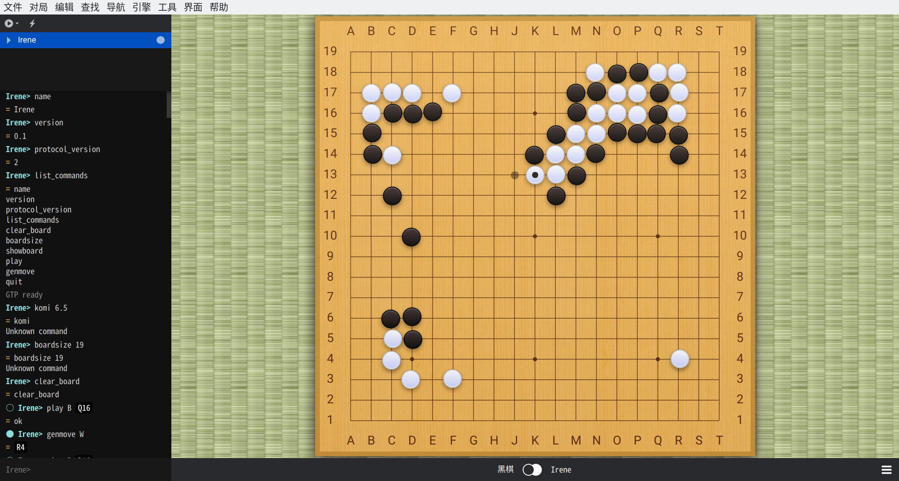
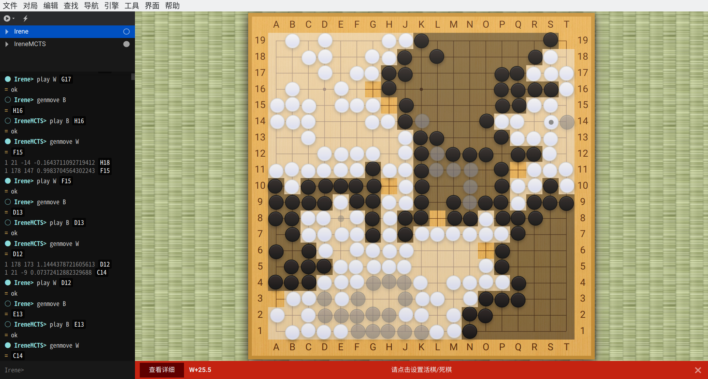

## Irene

> 名称来源于 [Portrait of Irène Cahen d'Anvers](https://en.wikipedia.org/wiki/Portrait_of_Irène_Cahen_d'Anvers)
>

围棋 AI，仿照 Alphago，实现了简单的**策略网络**、**价值网络**和**蒙特卡洛搜索**

+ 策略网络输入是 features，输出是各个位置或 pass 的概率（对数）。使用 5 层卷积
+ 价值网络输入 features，输出胜率。也用到了卷积网络
+ 蒙特卡洛搜索（MCTS）在策略网络输出的排名前几的选点中选择合适的

> 其中 features 包括棋的位置、各个位置气的数量、最近的移动记录等信息。

AlphaGo 使用的是更多层卷积（包含残差网络）、更多 features，使用强化学习产生更多的数据。

由于计算资源的限制，Irene 只使用有监督的形式训练大约 2000 张棋谱。因为价值网络的预测较为不准确，MCTS 中使用棋子数作为评估指标。

### 文件结构

| 文件           | 用途                                                         |
| -------------- | ------------------------------------------------------------ |
| filter.py      | 从原始数据中选取合适的（没有让子）                           |
| go.py          | 围棋规则                                                     |
| features.py    | 从各张棋谱中获取数据                                         |
| prepareData.py | 准备数据                                                     |
| net.py         | 策略网络、价值网络的结构                                     |
| train.py       | 训练网络                                                     |
| genMove.py     | 使用训练的网络生成输出（直接使用策略网络，或者用 MCTS 搜索） |
| gtp.py         | 以 GTP 协议从命令行传输数据                                  |

### 使用方式

安装依赖

```bash
pip install torch numpy sgfmill
```

获取并处理数据

```bash
wget https://pjreddie.com/media/files/jgdb.tar.gz
tar xvf jgdb.tar.gz
```

```bash
python filter.py
python prepareData.py
```

训练网络

```bash
python train.py policyNet
python train.py playoutNet
python train.py valueNet
```

以 GTP 协议运行

> 可以使用图形界面的 [Sabaki](https://github.com/SabakiHQ/Sabaki) 连接 GTP 协议的程序

```bash
python gtp.py
```

### 结果

策略网络训练的正确率可以达到 35%。价值网络预测输赢的正确率达到 90%，但实际效果不理想，可能与训练集和测试集中部分形状相似有关。

使用策略网络的 AI 会走一些定式。计算上会出问题，算不清征子



使用策略网络，并结合以棋子数为评估指标的 MCTS 搜索时，AI 倾向于吃子，计算力有所提高。但围棋更重要的是围空，吃子有时并不利于围空。



### 参考

+ [Mastering the game of Go with deep neural networks and tree search](https://www.nature.com/articles/nature16961)
+ [Mugo GitHub](https://github.com/brilee/MuGo)
+ [ml_implementation MCTS GitHub](https://github.com/tobegit3hub/ml_implementation/blob/master/monte_carlo_tree_search/mcst_example.py)
+ [28 天自制你的 AlphaGo 知乎](https://zhuanlan.zhihu.com/p/24885190)

### 感谢

+ [Sabaki](https://github.com/SabakiHQ/Sabaki)
+ [sgfmill](https://github.com/mattheww/sgfmill)
